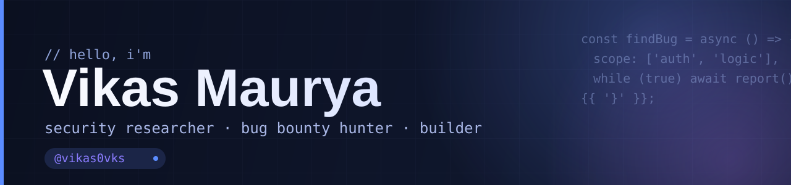

  

  <b>Vikas Maurya</b> &nbsp;·&nbsp; <code>@vikas0vks</code>

  Bug bounty hunter & AppSec researcher, focused on <b>business logic and access control</b>. I also build the tooling that makes testing faster.

  
  
  
  
  

---

## About

I research web application security and hunt bugs: the flaws that hide in how an application is
*meant* to work.

- I break applications by testing their **logic**, not just their inputs
- I write findings up properly and report through platforms such as **HackerOne**
- I build tools to automate the boring parts of testing
- Hall of Fame recognitions from **Google** and **OZiva**

## What I build

| Project | What it is |
| --- | --- |
| [SastraCode](https://github.com/vikas0vks/sastracode-builds) | A coding assistant for Android. It reads and edits projects, runs commands, and manages long tasks on-device. Installable builds are public; source is private. |
| [JSNinja](https://github.com/vikas0vks/JSNinja) | Extracts URLs and secrets from JavaScript files. Built for pentesters and bug bounty hunters analysing JS at scale. |
| [Pentabar](https://github.com/vikas0vks/pentabar) | A web security and penetration testing toolkit for Android. |

More is in private development: a zero-knowledge password manager (Rust core, WebAssembly,
Cloudflare Workers) and ongoing research.

## Writing

I share findings and a [bug bounty methodology guide](https://medium.com/@vikas0vks/list/methodology-3aa7c4183b7b) on Medium.

---

  
  &nbsp;
  
  &nbsp;
  

<em>Security is not a product. It is a process.</em>

