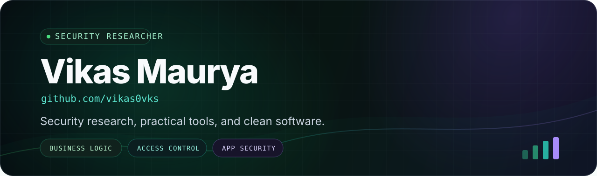
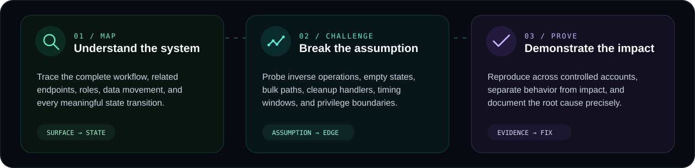
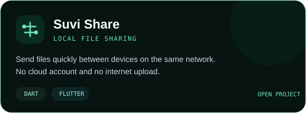
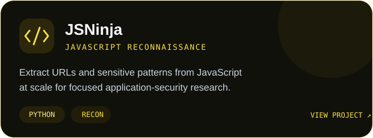
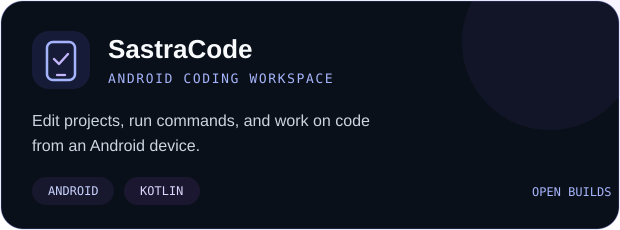
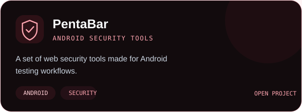
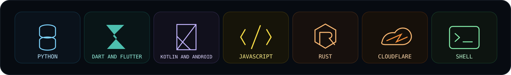
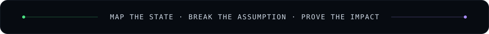

  

  
  
  
  

  Security researcher focused on business logic, access control, and web application testing. 
  I also build useful Android and desktop tools.

  Security findings reported through HackerOne. Recognition from Google and OZiva.

## How I test

## Featured builds

  
  

  
  

## Systems I work with

## How I work

- Understand how the feature works before testing edge cases.
- Check related actions, user roles, account states, and access rules.
- Test with controlled accounts and keep clear evidence.
- Report only what can be reproduced and verified.

